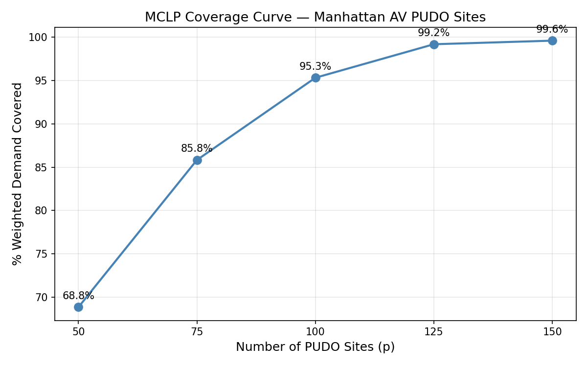
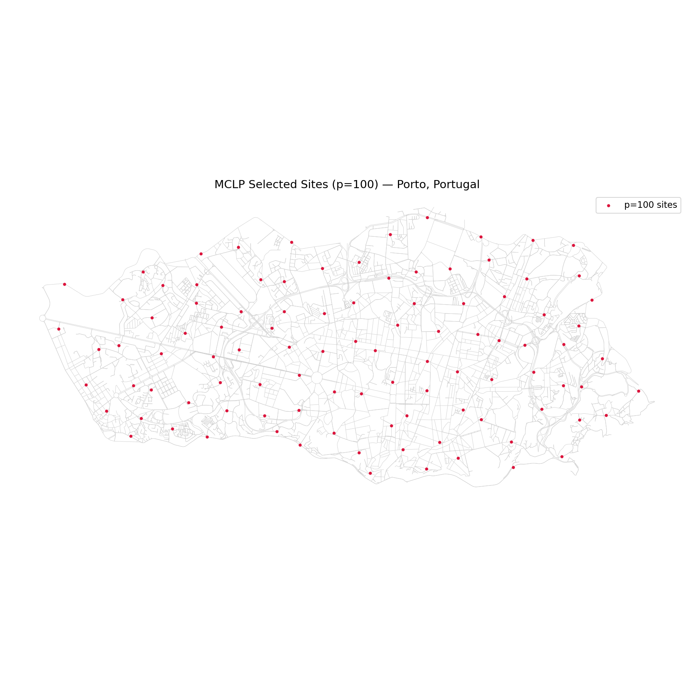

# NYC AV PUDO Index

> GitHub's notebook renderer is currently broken for these files. Click a badge below to view each notebook on nbviewer.

| Notebook | View |
|---|---|
| 01 — Data Collection | [](https://nbviewer.org/github/ahedy7/nyc-av-pudo-index/blob/master/notebooks/01_data_collection.ipynb) |
| 02 — NKDE | [](https://nbviewer.org/github/ahedy7/nyc-av-pudo-index/blob/master/notebooks/02_nkde.ipynb) |
| 03 — Candidates | [](https://nbviewer.org/github/ahedy7/nyc-av-pudo-index/blob/master/notebooks/03_candidates.ipynb) |
| 04 — Optimization | [](https://nbviewer.org/github/ahedy7/nyc-av-pudo-index/blob/master/notebooks/04_optimization.ipynb) |
| 05 — Equity | [](https://nbviewer.org/github/ahedy7/nyc-av-pudo-index/blob/master/notebooks/05_equity.ipynb) |


**Optimizing autonomous-vehicle pick-up and drop-off (PUDO) station siting in NYC, with a reproducible pipeline that generalizes to any city with taxi or ride-share data.**

---

Self-driving cars used to feel like a back-to-the-future novelty. With Waymo expanding city to city and Robotaxi and other competitors entering the market, autonomous vehicles are now asserting themselves as real transportation infrastructure. That shift creates a concrete, unglamorous problem: where do these vehicles actually stop?

Curb space is scarce. Uber, Lyft, Waymo, delivery trucks, and micromobility all want the curb at the same time. Designated PUDO zones reduce that chaos and improve safety and fleet efficiency. The constraint is sharpest for AVs specifically, because a human driver can double-park or block a hydrant for thirty seconds and react to a cop, while an AV needs a guaranteed, legal, predictable place to stop. The benefits apply to human-driven TNCs too (Hunter & Kockelman, 2023), but automation is what makes pre-designated curb space a hard requirement rather than a nice-to-have.

This project picks where those PUDO stations should go. Using 2010 NYC Yellow Taxi data (the most recent publicly available NYC ride data with true latitude and longitude coordinates), road geometry from OpenStreetMap, and curb constraint layers from the NYC Open Data portal, it builds a demand surface along the road network and solves a Maximal Coverage Location Problem (MCLP) to select the set of stations that covers the most demand within walking distance. It then runs an equity-weighted variant that reweights demand toward transit-dependent, lower-income neighborhoods and measures the coverage cost of that tradeoff. Finally, the base pipeline is refactored into a config-driven notebook that runs on any city, validated on Porto, Portugal.

## What this is, and what it isn't

This is a **siting tool**. It answers which blocks should host PUDOs and where, given real demand, curb constraints, and road geometry. It is the planning input that comes *before* operational simulation (like POLARIS) or fleet dispatch modeling, not a replacement for them. It does not simulate vehicle routing, rider matching, or real-time fleet behavior. The output is the analytical starting point a planner or operator refines, not a finished deployment map.

## Key results

**Manhattan (base optimization).** Selecting from 7,644 constraint-filtered candidate sites, coverage of NKDE-weighted demand within a 500m network radius:

| Sites (p) | Demand covered |
|-----------|----------------|
| 50        | 68.8%          |
| 75        | 85.8%          |
| 100       | 95.3%          |
| 125       | 99.2%          |
| 150       | 99.6%          |

The curve shows sharp diminishing returns past ~100 sites, which is the practical fleet-size signal: roughly 100 stations cover 95% of Manhattan demand, and everything beyond that buys very little.



**Equity-weighted optimization.** Reweighting demand toward low-income, low-vehicle-ownership tracts shifts coverage measurably toward neighborhoods like the West Village, Greenwich Village, East Harlem, and the Lower East Side, and away from Central Park, Stuyvesant Town, and the Upper East Side. The neighborhood-level comparison quantifies exactly which areas gain and lose coverage under an equity constraint.


**Generalization (Porto, Portugal).** The same pipeline, pointed at 1.7M Porto taxi trajectories with nothing changed but a config object, produces a clean coverage curve and a sensible, organically distributed site set. Porto's irregular medieval street layout spreads sites naturally, in contrast to the grid-aligned pattern Manhattan produces.



## Methodology

The framework follows the MCLP-on-a-road-network approach from Wang et al. (2025) and the curb-aggregation logic from Hunter & Kockelman (2023), extended with curb constraint layers, an equity component, and a generalization step.

**Stage 1 — Data collection.** 2010 Yellow Taxi pickups filtered to Manhattan (June, a representative month with no major holidays), drivable road network and nodes from osmnx, and curb constraint layers from NYC Open Data: bus stop shelters (756), fire hydrants (26,204), bike lanes (13,528), and loading and no-standing zones (11,582, filtered from parking regulation sign types). All layers projected to a common CRS for spatial joins, with the road network also loaded into a PostGIS database.

**Stage 2 — Network Kernel Density Estimation (NKDE).** Pickup points snapped to their nearest road edges with `ox.nearest_edges` and aggregated to a demand count per edge. NKDE then smooths that point data into a continuous demand surface along the network, using a quadratic kernel, a 500m bandwidth, and network distance rather than straight-line distance, so a point across an uncrossable highway is correctly treated as far away. A `log1p` transform is applied before normalizing scores to 0–1 to compress outliers. The correlation between raw edge demand and the smoothed NKDE score is 0.65, confirming the smoothing preserved the demand signal while spreading it sensibly.

**Stage 3 — Candidate generation and constraint filtering.** Candidate PUDO sites are interpolated every 400m along eligible road edges, excluding highway types unsuitable for curb stops (motorway, trunk, raceway, service, and their links). This yields 13,055 candidates. Each candidate is then filtered against the curb constraint layers, removed if within 15m of a bus stop, 10m of a hydrant, 5m of a bike lane, or 10m of a loading or no-standing zone, leaving 7,644 valid sites.

**Stage 4 — MCLP optimization.** The Maximal Coverage Location Problem selects *p* sites to maximize NKDE-weighted demand covered within 500m network distance, where a demand point counts as covered if at least one selected site is within range (no double-credit for overlapping coverage). The coverage matrix is precomputed with a Euclidean pre-filter followed by pandana network-distance queries, and the problem is solved with PuLP and the CBC solver. Run across p = 50, 75, 100, 125, 150 to produce the coverage curve.

**Stage 5 — Equity-weighted optimization.** Demand is reweighted using two ACS variables for Manhattan (county FIPS 061), vintage 2006–2010 to match the demand data: B19013 (median household income) and B08201 (vehicle availability). Tracts with lower income and higher zero-vehicle-household rates receive a higher equity weight, which inflates their demand in the objective and pulls sites toward them. The same MCLP is solved on the reweighted demand, and the base and equity selections are compared at the neighborhood (NTA) level.

**Stage 6 — Generalization.** The base pipeline is refactored into a single config-driven notebook that runs on any city given only latitude and longitude demand points. The projected CRS is auto-derived from the data (UTM zone computed from longitude), and the street network is pulled automatically from OpenStreetMap. Validated on Porto, Portugal, run at p = 20, 40, 55, 70, 85, 100. The right station count scales with coverage *area*, not population: Porto municipality is roughly 70% of Manhattan's footprint, and its coverage-curve knee sits accordingly around 70 sites.

## Academic foundation

This methodology builds on peer-reviewed research rather than being invented from scratch.

**Wang et al. (2025)**, *Network-based pick-up and drop-off location optimization for shared autonomous vehicles*, established the NKDE + MCLP-on-a-road-network approach using DiDi trip data in Chengdu. They show that operating on the road network rather than census-tract centroids with Euclidean distance produces materially better siting, and that their MCLP beats both random and greedy demand-only baselines. This project applies that framework to NYC and adds the curb constraint layers and equity component they list as future work.

**Hunter & Kockelman (2023)**, *Curb Allocation and Pick-Up Drop-Off Aggregation for a Shared Autonomous Vehicle Fleet*, simulate the Austin metro with the POLARIS agent-based model and quantify the curb-space and efficiency tradeoffs of different PUDO spacings. Their work is the operational simulation that assumes a service area is already defined. This project is the siting decision that comes one step earlier, the input such a simulation needs.

## Limitations

These are real, and naming them is part of the work. Each reflects the gap between a model and a deployment.

**The model optimizes coverage, not place or curb capacity.** The MCLP will place two sites close together on the same avenue if each covers distinct demand, but a real PUDO needs physical curb space (roughly a small loading zone's footprint), and no planner would site them that close on one corridor. The model also treats a station handling 50 pickups an hour identically to one handling 500, because it optimizes coverage rather than throughput. A deployment-ready version would need curb-capacity and minimum-separation constraints layered on top.

**It under-weights urban-design judgment.** Optimization finds the mathematically optimal set, but siting PUDOs is partly a design decision about legibility, intuitive anchor points, and integration with existing transit. This tool produces the analytical starting point; a planner refines it.

**The demand signal is a revealed-preference proxy, and it's old.** 2010 TLC data is the most recent NYC ride data with true coordinates (TLC removed them from all post-July-2016 data), but it reflects where people took yellow cabs in 2010, not where they'll want AV service. Demand is also endogenous: once PUDOs exist they change where people want rides, so siting on current demand is informative but circular. Modeling that properly requires agent-based demand simulation, which is out of scope here.

**Static curb constraints, not real-time occupancy.** The model filters against fixed features like hydrants, bus stops, and bike lanes, but it cannot see dynamic peak-hour curb competition, because that data is not publicly available at the block level for NYC. The siting reflects static curb availability, not the rush-hour fight for space.

## Tech stack

Python, GeoPandas, osmnx, NetworkX, pandana (network-distance queries), PuLP with the CBC solver (integer programming), Shapely, the Census API for ACS data, and PostGIS for the road network. ArcGIS Pro was used for cartographic QA only, not as part of the analytical pipeline. Visualization in matplotlib, with an interactive deck.gl dashboard in progress.

## Repo structure

```
nyc-av-pudo-index/
├── data/
│   ├── raw/          # source data (gitignored)
│   ├── processed/    # pipeline outputs
│   └── outputs/      # figures and exports
├── notebooks/
│   ├── 01_data_collection.ipynb
│   ├── 02_nkde.ipynb
│   ├── 03_candidates.ipynb
│   ├── 04_optimization.ipynb
│   ├── 05_equity.ipynb
│   └── 06_generalize.ipynb   # config-driven, runs on any city
├── src/
├── dashboard/
└── README.md
```

## Reproducing the pipeline

The constraint layers in `data/raw/` are gitignored. To regenerate them, run `python src/download_nyc_layers.py` from the repo root, then run notebooks 01 through 05 in order. To run the pipeline on a different city, open `06_generalize.ipynb`, point the `CONFIG` dict at a file of lat/lon demand points, and run it; the network and projected CRS are derived automatically.
